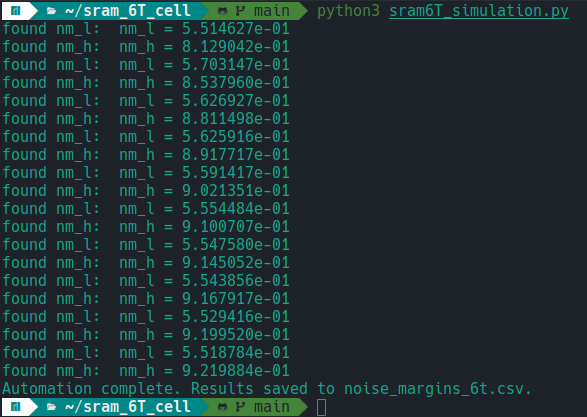

# 6T SRAM Cell Simulation and Analysis

This project contains the schematic, SPICE netlist, and simulation results for a **6-transistor (6T) SRAM cell**, including DC transfer characteristics, the butterfly curve, and noise margin calculation.

## Contents

- **Schematic** of the 6T SRAM cell.
- **DC sweep plot** showing the voltage transfer curves of internal nodes.
- **Butterfly curve** for static noise margin (SNM) analysis.
- Python code for netlist parsing and data extraction (explained below).

## Schematic


The 6T SRAM cell consists of:
- Two cross-coupled CMOS inverters (M1–M2 and M17–M26).
- Two NMOS access transistors (M3, M4) controlled by the word line (WL).
- Bit lines **BL** and **BLB** for read/write operations.

## Simulation Plots

### DC Sweep


This plot shows the DC sweep of the internal nodes **q** (red) and **qbar** (blue) as the input sweep voltage is varied. It illustrates the inverter transfer characteristics and the bistable nature of the SRAM cell.

### Butterfly Curve


The butterfly curve is obtained by plotting the inverter characteristics against each other. The **static noise margin (SNM)** is determined from the largest square that can fit inside the lobes of this curve.

---

## How to Run Simulations:

### Viewing the Schematic:
To open the schematic in Xschem:
```bash
xschem sram_6t_cell.sch
```
### Running Ngspice for the plots:
This runs the ngspice simulation and shows the plots, note that temp.spice is the file generated after final simulation loop i.e it has maximum defined paramaters. 
```bash
ngspice sram6tplots.spice
```
The plots itself is done by following lines in spice file
```spice
.include "sram_6t_cell.spice"
.control
run
*this plots the voltage transfer characteristics curve(vtc) for 6T cell for the  original W/L ratios, in case you want to vary W/L chnage it in original spice netlist
plot Q Qbar 
*this plots butterfly curve of 6T cell you can calucate SNM(static noise margin)  from this by placing largest fittable square in one upper reigion or finding largest diagonal intersecting the curve
plot v(Q) vs v(Qbar) v(Qbar) vs v(Q) 
.endc
```
### Ngspice noise margin logic:
The .control block added to ngspice takes care of the noise margin calculation, albeit it could've been done in python but its more practical to use spice itself for the calculations because when we have a very large number of cells then importing it to python and calculating it over there is lot slower and to avoid that latency issue its preferred to run it on spice itself.
The calculation is pretty straight forward you just need to find the rate of change of the curve specifically at points where its derivative is negative one for the first time and second time that is what this block handles
```spice
.control
 run
let dVQbar=deriv(V(Qbar))
meas dc Vil FIND V(Q) WHEN dVQbar=-1 CROSS=1
meas dc Vih FIND V(Q) WHEN dVQbar=-1 CROSS=2
meas dc Vol FIND V(Qbar) WHEN dVQbar=-1 CROSS=2
meas dc Voh FIND V(Qbar) AT=0.1
let NM_H=Voh-Vih
let NM_L=Vil-Vol
print NM_L NM_H
.endc
```
In ```mySRAM_6t.spice```, Ngspice calculates:

- **NM_L**— lower noise margin.
- **NM_H**— higher noise margin.

**Method:**
  - Sweep input voltage, record **q** and **qbar**.
  - **Mirror one curve** → generate butterfly curve.
  - Fit the largest possible square inside each lobe.

     ```SNM = min(NM_L, NM_H)```
One important thing to consider before running the python script is that ```mySRAM_6t.spice``` uses  **placeholders** for transistor dimensions:
```spice
M1 q qbar GND GND nmos W={W_nmos} L={L_nmos}
M2 qbar q VDD VDD pmos W={W_pmos} L={L_pmos}
```
The are set such that widths and lengths are considered to be a varibale to be updated by the python script while running each simulation. The aspect ratios will be taken accordingly and the spice file will be parsed by python and updated. These values are printed in Ngspice output and parsed by the Python script.

**NOTE:**

I have not yet updated the code for the following functionalities:
1. It does to generate a seperate spice file for each iteration.
2. The manual SNM calculation is not integrated into spice file yet but however its not that hard, for anyone wishing to add the SNM calculation you can refer the following paper and update the given formulas into the ```.control``` block of spice file.
##  Related Research

This work builds upon the foundational static noise margin methodology introduced by:

**E. Seevinck, F. J. List, and J. Lohstroh**, “Static-noise margin analysis of MOS SRAM cells,” *IEEE Journal of Solid-State Circuits*, vol. 22, no. 5, pp. 748–754, Oct. 1987.  
Available via IEEE (requires access): [doi:10.1109/JSSC.1987.1052809](https://doi.org/10.1109/JSSC.1987.1052809)

## Python script for Automation:
The python script ```sram6T_simulation.py``` can be run by the command:
```python
python3 sram6T_simulation.py
```
once its running you will see something like this on your terminal:



Currently it is set to Run 10 iterations but you can change it to run a lot more.

**NOTE:**
- The iterations can be as many as you wish to simulate but be careful to not cross the PDK-constraints. For the sky130A pfets and nfets there are some threshold aspect ratios to be considered and it may vary according to the PDK and cells you are using. Here I used the LVT-cells from the PDK. Check your PDK documentation for knowing the particular constraints.
  **W/L** values are set according to PDK limits:

  - NMOS: W ≥ 0.3 µm, L ≤ 1.5 µm
  - PMOS: Usually W is 2× NMOS W, L starts from ~0.35 µm for LVT cells.

  These placeholders are replaced dynamically by the Python script for sweeps.
Now you can change the following lines of code from ```sram6T_simulation.py``` according to the cells and PDK you are using:
```python
W_nmos_values = np.linspace(1, 10, 10)
L_nmos_values = np.round(np.linspace(0.15, 1.1, 10), 2)
W_pmos_values = W_nmos_values * 2
L_pmos_values = np.round(np.linspace(0.35, 1.35, 10), 2)
```
The syntax is straightforward ```np.linspace(start,stop,num)``` , the starting vallue is start amd final value is given in stop and num is the number of equally spaced values between start and stop. The ```np.round(value,upto_decimal)``` is just to round off to second decimal just so that it looks neat and obviously realistic. Just vary it as you wish. Also I just put the pmos widths as twice as nmos widths just taking care of carrier mobility of pmos but its not absolutely necessary and an actual SRAM cells aspect ratios are much more specifically chosen, but this is just a standard practice in Digital circuits.

### Running Ngspice from Python

Inside the automation loop in `sram6T_simulation.py`, we use:

```python
process = subprocess.run(["ngspice", "-b", "temp.spice"], capture_output=True, text=True)
```
**Breakdown:**
- `subprocess.run([...])` Runs an external program (here, ngspice) from Python and waits until it finishes.

-  ["ngspice", "-b", "temp.spice"]

  - **ngspice →** the SPICE simulator executable.

  - **-b →** batch mode (no interactive GUI; runs silently).

- **temp.spice →** the SPICE netlist to simulate (auto-generated in the loop).

  - `capture_output=True` Captures both stdout (normal output) and stderr (errors). Without this, Ngspice output would be printed directly to the terminal.

  - `text=True` Returns output as a string instead of raw bytes, making it easy to parse.

This way the python script allows running multiple simulations automatically without opening the Ngspice GUI.The simulation output is stored in `process.stdout`, so the script can search for results:
```python
output_lines = process.stdout.split("\n")
```
Enables automatic extraction of NM_L and NM_H from simulation logs.

                         **This is how you use the script ! hope it helps someone out there.**


